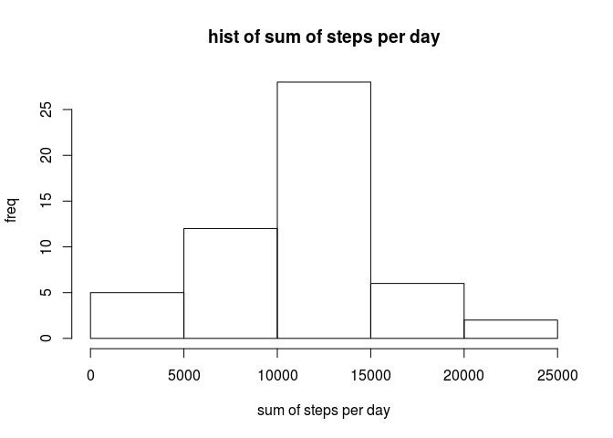
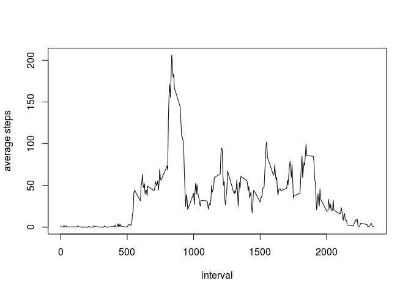
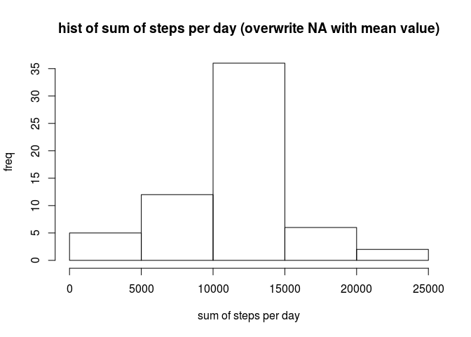
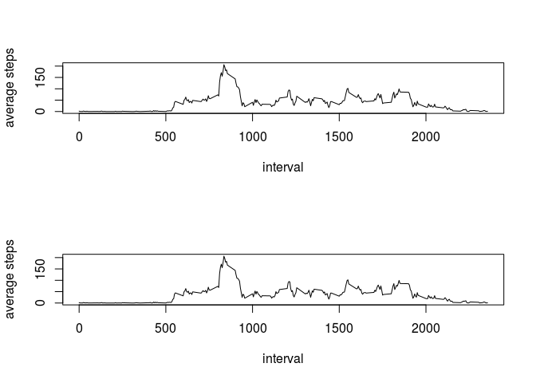

## Loading and preprocessing the data

unarchive data and show summary.


```r
unzip("activity.zip")

activity <- read.csv("activity.csv");

summary(activity)
```

```
##      steps                date          interval     
##  Min.   :  0.00   2012-10-01:  288   Min.   :   0.0  
##  1st Qu.:  0.00   2012-10-02:  288   1st Qu.: 588.8  
##  Median :  0.00   2012-10-03:  288   Median :1177.5  
##  Mean   : 37.38   2012-10-04:  288   Mean   :1177.5  
##  3rd Qu.: 12.00   2012-10-05:  288   3rd Qu.:1766.2  
##  Max.   :806.00   2012-10-06:  288   Max.   :2355.0  
##  NA's   :2304     (Other)   :15840
```


## What is mean total number of steps taken per day?


```r
aggdate <- aggregate(steps ~ date, activity, sum)

hist(aggdate$steps,
     xlab="sum of steps per day", ylab="freq", main="hist of sum of steps per day")
```

<!-- -->

```r
cat("mean   = ", mean(aggdate$steps), "\n")
```

```
## mean   =  10766.19
```

```r
cat("median = ", median(aggdate$steps), "\n")
```

```
## median =  10765
```

## What is the average daily activity pattern?

```r
aggdate2 <- aggregate(steps ~ interval, activity, mean)

plot(x=aggdate2, type="l",
     xlab="interval", ylab="average steps")
```

<!-- -->

```r
cat("max average value: ", aggdate2[which.max(aggdate2$steps), 2], " interval: ", aggdate2[which.max(aggdate2$steps), 1])
```

```
## max average value:  206.1698  interval:  835
```


## Imputing missing values

```r
cat("num of missing value = ", sum(is.na(activity$steps)), "\n")
```

```
## num of missing value =  2304
```

```r
fill = activity
fill[is.na(fill)] <- mean(aggregate(steps ~ interval, activity, mean)$steps)

summary(fill)
```

```
##      steps                date          interval     
##  Min.   :  0.00   2012-10-01:  288   Min.   :   0.0  
##  1st Qu.:  0.00   2012-10-02:  288   1st Qu.: 588.8  
##  Median :  0.00   2012-10-03:  288   Median :1177.5  
##  Mean   : 37.38   2012-10-04:  288   Mean   :1177.5  
##  3rd Qu.: 37.38   2012-10-05:  288   3rd Qu.:1766.2  
##  Max.   :806.00   2012-10-06:  288   Max.   :2355.0  
##                   (Other)   :15840
```

```r
fixed <- aggregate(steps ~ date, fill, sum)

hist(fixed$steps,
     xlab="sum of steps per day", ylab="freq", main="hist of sum of steps per day (overwrite NA with mean value)")
```

<!-- -->

```r
cat("mean   = ", mean(aggdate$steps),   " -> ", mean(fixed$steps) ,  "\n")
```

```
## mean   =  10766.19  ->  10766.19
```

```r
cat("median = ", median(aggdate$steps), " -> ", median(fixed$steps), "\n")
```

```
## median =  10765  ->  10766.19
```


## Are there differences in activity patterns between weekdays and weekends?


```r
Sys.setlocale(locale="C")
```

```
## [1] "LC_CTYPE=C;LC_NUMERIC=C;LC_TIME=C;LC_COLLATE=C;LC_MONETARY=C;LC_MESSAGES=ja_JP.UTF-8;LC_PAPER=ja_JP.UTF-8;LC_NAME=C;LC_ADDRESS=C;LC_TELEPHONE=C;LC_MEASUREMENT=ja_JP.UTF-8;LC_IDENTIFICATION=C"
```

```r
weekend <- weekdays(as.Date(activity$date)) %in% c("Saturday", "Sunday")
weekday <- weekdays(as.Date(activity$date)) %in% c("Monday", "Tuesday", "Wednesday", "Thursday", "Friday")

act_weekday <- activity
act_weekend <- activity

par(mfrow=c(2, 1))
plot(x=aggregate(steps ~ interval, act_weekday, mean), type="l",
     xlab="interval", ylab="average steps", pch=1)
plot(x=aggregate(steps ~ interval, act_weekend, mean), type="l",
     xlab="interval", ylab="average steps", pch=2)
```

<!-- -->

